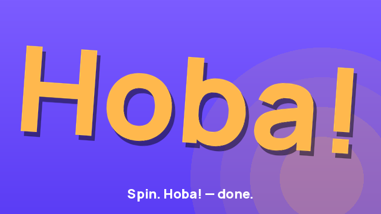

# Hoba!

> A Telegram Mini App party game. Tap the wheel. It spins. It stops. **Hoba!** — and the argument's over.

<p align="center">
  
</p>

For the moment four people are stuck choosing where to eat, who pays, who's first.
Spin together, share a single source of truth, settle it in five seconds.

`Hoba!` is the brand in English. `Хоба!` is the same brand in Ukrainian. Both ship first-class.

---

## Status

**Stage C — soft launch (May 2026).** Invite-only validation with a small friend group; not yet public. Once Stages D–G land (more game modes, polish, hardening), the bot opens to everyone.

The bot lives at [@hobagame_bot](https://t.me/hobagame_bot). The Mini App URL is private during the soft-launch phase.

---

## What's in it today

- **Solo mode.** Pick a Quick Wheel ("Where to eat?", "Who pays?", "Truth or Dare", …) or build your own in `/create`. Spin → branded `Hoba!` / `Хоба!` reveal → confetti + haptics + sound.
- **Multiplayer rooms.** Server-authoritative spin. Two phones, one room, identical animation within ±50 ms. Reactions fly across every connected client during the spin. Share via Telegram's native picker.
- **Host controls.** Live spin-policy toggle, in-flight `room:updated` broadcasts so guests see policy changes without a reconnect.
- **Two languages, full parity.** EN + UK end-to-end; CI enforces locale parity via `pnpm i18n:check`. Brand word flips with the locale.
- **Mobile-native.** No hover states, 44×44 px tap targets, sheets instead of modals. If a screen looks at home on a desktop browser, the spec considers it a bug.

Coming in Stages D–E: **five game modes** (Classic, Elimination, Punishment, Chaos, and the legendary **Rigged 🎭**).

---

## Tech stack

| Layer | Choice | Why |
|---|---|---|
| Backend | **FastAPI** + **python-socketio** + **aiogram 3** | Async Python; one ASGI app serves REST, WebSocket, and the bot polls. |
| Persistence | **SQLAlchemy 2.0** + **SQLite** (`aiosqlite`); Redis 7 for ephemeral state | URL-swap-ready for Postgres at scale. Redis owns presence + rate limits + cache. |
| Frontend | **React 18** + **Vite 5** + **TypeScript 5 strict** + **Tailwind** + **Framer Motion** + **Zustand** | Familiar stack; HMR for dev, static bundle for prod. |
| Telegram | **@twa-dev/sdk** + Direct Link Mini App | Theme, viewport, share, BackButton, haptics — all native. |
| i18n | **react-i18next** + **ICU** | Plural rules + interpolation in EN/UK; parity enforced by `scripts/i18n-check.mjs`. |
| Quality | **pytest**, **ruff**, **mypy --strict**, **eslint**, **tsc --noEmit**, **vitest** | Every gate green at every stage close. |
| Deploy | Docker Compose; Caddy auto-TLS in the bundled prod profile, or host nginx in shared-VPS mode | One command up, both flavours documented. |

113 backend tests + 53 frontend tests at Stage C entry, 91 % backend coverage.

---

## Repository layout

```
apps/
  api/            FastAPI + Socket.IO    (python package: hoba_api)
  bot/            aiogram bot            (python package: hoba_bot)
  webapp/         React + Vite + TS Mini App
docs/
  spec.md         Product + engineering spec — source of truth
  roadmap.md      Stages A → G post-MVP execution order
  architecture.md How the services compose at runtime
  development.md  Local setup + dev tunnel + debugging
  deployment.md   Production deploy walkthrough (dedicated + shared VPS)
  testing.md      Test layout + manual verification per stage
  spec.md, …      Several more — see CLAUDE.md for the full index
infra/
  caddy/          Caddyfile for the bundled prod profile
  nginx/          Server block for the shared-VPS flavour
scripts/
  i18n-check.mjs  EN ↔ UK locale parity + referenced-key coverage
CLAUDE.md         Operational guide (this file is for humans + AI assistants alike)
```

---

## Quick start

Three commands for a working local environment. The bot runs in **idle mode** with no token, which is fine for everything except real Telegram launches.

```bash
cp .env.example .env             # then fill TELEGRAM_BOT_TOKEN if you have one
docker compose up                # api :8000, webapp :5173, redis :6379, bot polling
ngrok http 5173                  # only when you want to test inside real Telegram
```

- **Webapp:** http://localhost:5173
- **API docs:** http://localhost:8000/docs
- **Design-system showcase:** http://localhost:5173/dev/ds

Full setup, tunnel walkthrough, and debugging recipes live in [`docs/development.md`](docs/development.md). Production deploy is in [`docs/deployment.md`](docs/deployment.md). Tests + manual verification per stage in [`docs/testing.md`](docs/testing.md).

---

## 60-second walkthrough

<!-- TODO(owner): record + drop the GIF here → docs/brand/walkthrough.gif -->
<!--  -->

The whole loop in under a minute:

1. **Open** from the Telegram bot — land on the Home grid of 8 quick wheels.
2. **Tap a wheel** (e.g. *Where to eat?*) → it spins solo, the *Хоба!* word lands, confetti.
3. **Play together** → creates a room; share the link, a friend joins.
4. **Pick a mode** — Classic, Elimination, Punishment, Chaos, or 🎭 Rigged.
5. **Spin in turns**, react with emoji, watch the winner reveal.
6. **Save** the wheel to your library, or **make it public** → it shows up in Trending.

---

## Deploy to production

On the server, from the repo root (shared-VPS profile):

```bash
./scripts/deploy.sh          # git pull --ff-only + build + up + health check
./scripts/deploy.sh --no-pull   # rebuild the current tree without pulling
```

The script rebuilds the containers, lets the API run migrations on start (`AUTO_MIGRATE`), and polls `/health`. Full topology, TLS, and troubleshooting recipes are in [`docs/deployment.md`](docs/deployment.md).

---

## Quality gates

Every stage closes with all of these green:

```bash
# Backend
cd apps/api && pytest && ruff check src tests && mypy --strict src/hoba_api

# Frontend
cd apps/webapp && pnpm typecheck && pnpm lint && pnpm test

# Locale parity (run from repo root)
pnpm i18n:check
```

---

## Author

Built solo by **[Volodymyr Yahello](mailto:vyahello@gmail.com)** as a side project, in the open(-ish): the code's here so I remember how it works, the spec's here so future-me knows why I made the calls I made, and the roadmap's here because shipping a five-mode party game in one go is how you ship nothing.

## License

Proprietary — see [`LICENSE`](LICENSE).
